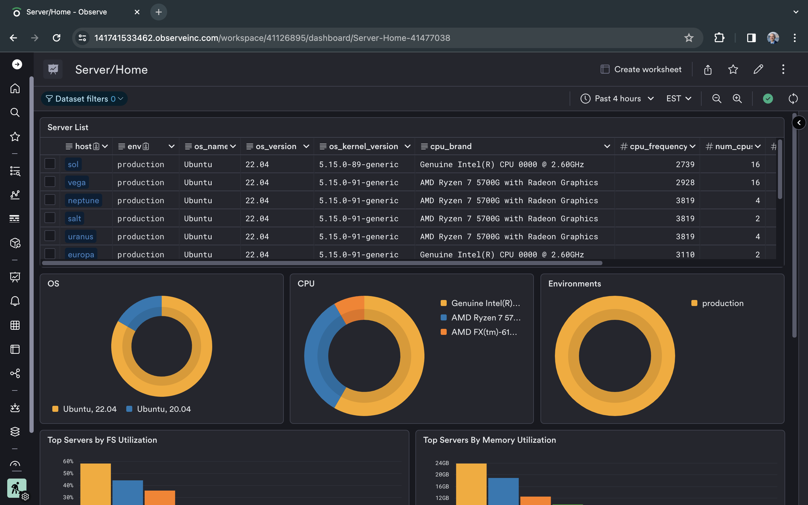
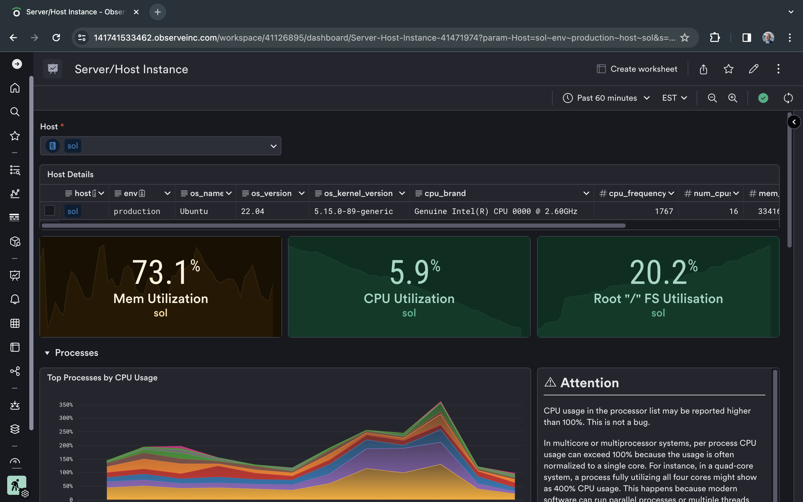

# sysinfo-rs

Small helper program to get system info and print it to stdout in JSON format. By default will daemonize itself and print basic system information, such as OS version, system name, amount of memory, etc. Use command line switches to fetch additional info. 

Intended to be run via systemd or another wrapper with output being consumed by a forwarding agent, such as [fluentbit](https://fluentbit.io/) or [vector](https://vector.dev/) and an observability platform such as [Observe](https://observeinc.com) to create dashboards, datasets and alerts, i.e:





## Status

Very early stages of development. Can crash as error-checking is not thorough. Not recommended for production.

## Usage

```
Usage: sysinfo-rs [-p] [-u] [-g] [-q] [-i <interval>]

Options:
  -p, --processes   print list of running processes
  -u, --users       print list of users on this system
  -g, --groups      print list of groups on this system
  -q, --quit        do not daemonize; get values once and quit
  -i, --interval    how often to fetch updated info, in seconds (default 300s,
                    minimum 15s)
  --help            display usage information
```

## Collected Info Data Schema Examples

| Schema              | Link                                          |
| ------------------- | --------------------------------------------- |
| System Information  | [Data Schema Example](./schemas/sysinfo.md)   |
| Process List        | [Data Schema Example](./schemas/processes.md) |
| Users               | [Data Schema Example](./schemas/users.md)     |
| Groups              | [Data Schema Example](./schemas/groups.md)    |


## Compiling and running

```sh
git clone https://github.com/rustomax/sysinfo-rs.git
cd sysinfo-rs
cargo build --release

```

Optionally strip the binary for minimal footprint

```sh
strip target/release/sysinfo-rs
```

Optionally move the binary to a path of your choosing, i.e.

```sh
sudo mv target/release/sysinfo.rs /usr/bin/sysinfo-rs
sudo chown root.root /usr/bin/sysinfo-rs
sudo chmod 755 /usr/bin/sysinfo-rs
```

Run the command. For instance, the following command will print system information summary, and the list of running process statistics and quit without daemonizing itself.

```sh
sysinfo-rs -p -q
```

## Usage with Forwarders

sysinfo-rs is intended to be used in conjunction with a service manager, like systemd, and/or a data consumer/forwarder, like Fluentbit or Vector. 

Vector in particular has a feature, where it can start and run a daemon and consume its stdout. Here is a sample Vector config template to start sysinfo-rs as a daemon and consume its output, including system information, list of users, list of groups and list of running processes, at 5-min intervals and forward the JSON data to Observe for further use in datasets, correlations, dashboards and monitors:

```yaml
sources:
  host_metrics:
    type: host_metrics
    scrape_interval_secs: 60
    filesystem:
      mountpoints:
        excludes:
          - "*/sys/kernel/debug/tracing"
          - "/var/snap*"
          - "/sys*"
          - "/proc*"
          - "/snap*"
          - "/run*"
          - "/dev*"
  journald_logs:
    type: journald
  sysinfo:
    type: exec
    mode: streaming
    decoding:
      codec: json
    command:
      [ "/usr/bin/observe/sysinfo-rs", "-u", "-p", "-g" ]

transforms:
  journald_logs_transform:
    type: remap
    inputs:
      - journald_logs
    source: |-
      .tags.observe_env = "{{ environment }}"
      .tags.observe_host = "{{ hostname }}"
      .tags.observe_datatype = "vector_journald_logs"
  host_metrics_transform:
    type: remap
    inputs:
      - host_metrics
    source: |-
      .tags.observe_env = "{{ environment }}"
      .tags.observe_host = "{{ hostname }}"
      .tags.observe_datatype = "vector_host_metrics"
  sysinfo_transform:
    type: remap
    inputs:
      - sysinfo
    source: |-
      .tags.observe_env = "{{ environment }}"
      .tags.observe_host = "{{ hostname }}"
      .tags.observe_datatype = "vector_sysinfo"

sinks:
  observe_metrics:
    type: prometheus_remote_write
    inputs:
      - host_metrics_transform
    endpoint: >-
      https://{{ observe_customer }}.collect.observeinc.com/v1/prometheus
    auth:
      strategy: bearer
      token: {{ observe_prom_token }}
    healthcheck: false
    request:
      retry_attempts: 5
  observe_logs:
    type: http
    inputs:
      - journald_logs_transform
    encoding:
      codec: json
    uri: >-
      https://{{ observe_customer }}.collect.observeinc.com/v1/http
    auth:
      strategy: bearer
      token: {{ observe_http_token }}
  observe_sysinfo:
    type: http
    inputs:
      - sysinfo_transform
    encoding:
      codec: json
    uri: >-
      https://{{ observe_customer }}.collect.observeinc.com/v1/http
    auth:
      strategy: bearer
      token: {{ observe_http_token }}
```
